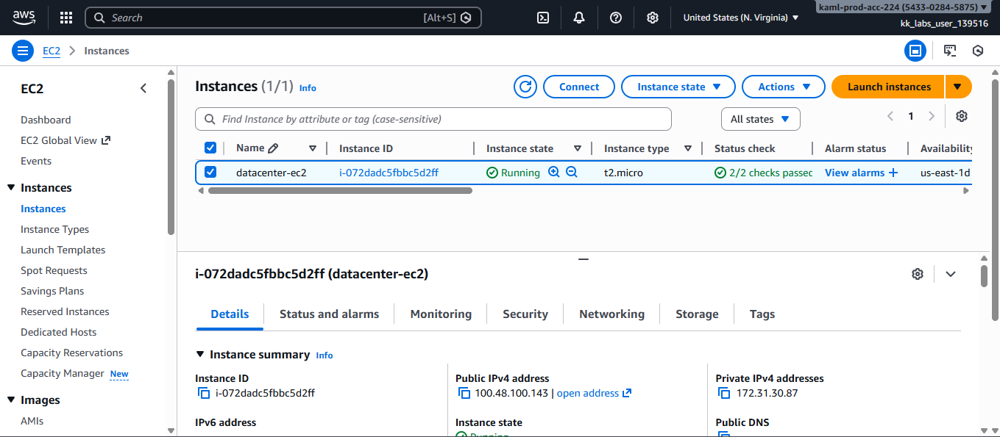
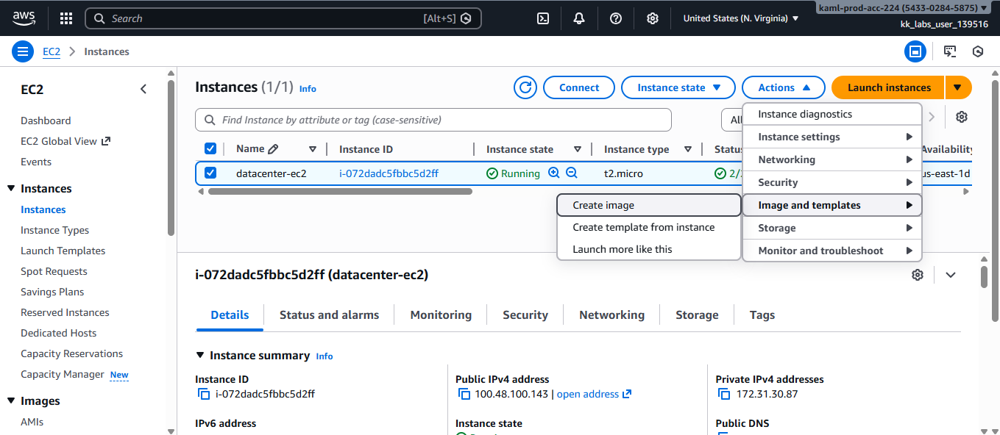
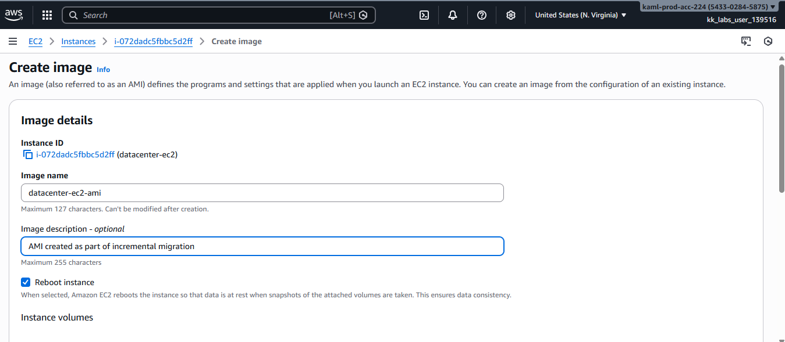
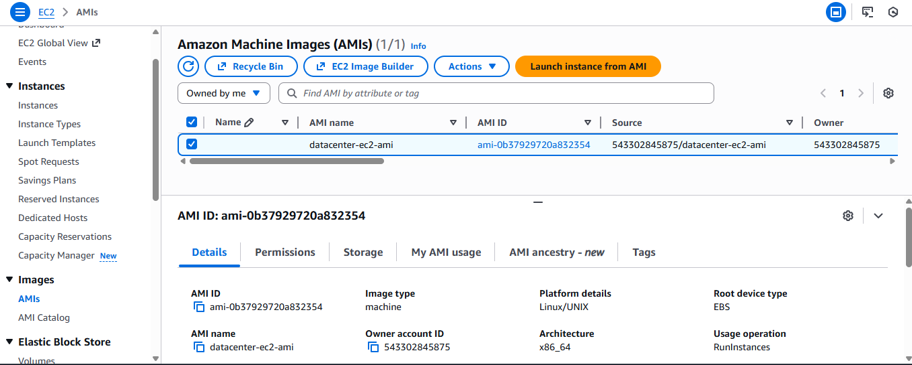
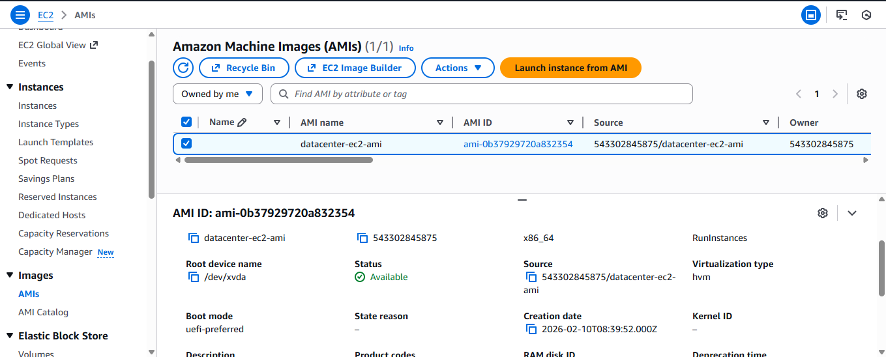

# Creating-an-AMI-from-an-Existing-EC2-Instance

This guide demonstrates how to create an **Amazon Machine Image (AMI)** from an existing **EC2 instance** using the **AWS Management Console**.  

An Amazon Machine Image (AMI) is a reusable template that contains the configuration needed to launch an EC2 instance. It includes the operating system, application server, installed software, and instance settings. AMIs allow you to quickly create identical EC2 instances, making them essential for scaling, backup, disaster recovery, and consistent infrastructure deployments.

## Step 1: Open the EC2 Dashboard

1. Sign in to the **AWS Management Console**
2. Navigate to **Services → EC2**

## Step 2: Locate the EC2 Instance

1. From the EC2 dashboard, click **Instances**
2. Locate the instance 
3. Ensure the instance is in a **Running** or **Stopped** state

## Step 3: Create the AMI

1. Select the instance
2. Click **Actions → Image and templates → Create image**
3. Enter the following details:
   - **Image name:** 
   - **Image description (optional):** `
4. Leave other settings as default unless otherwise required
5. Click **Create image**

## Step 4: Monitor AMI Creation

1. In the EC2 sidebar, click **AMIs**
2. Locate **`datacenter-ec2-ami`**
3. Monitor the **Status** column
4. Wait until the status changes from **Pending** to **Available**

## Why This Matters
Creating an AMI enables:
- Incremental and controlled cloud migration
- Consistent environment replication
- Faster recovery and rollback options
- Reduced risk during infrastructure changes

